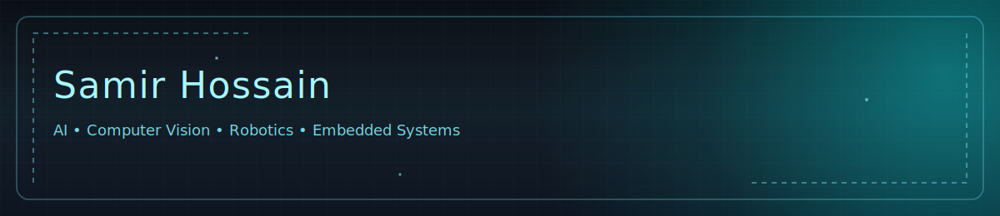

<!-- Profile README for SamirHossain099 -->

  

<h3 align="center">Engineer • Researcher • Builder</h3>

<em>AI-driven imaging, computer vision, and embedded robotics.</em>

---

### ⚡ Quick Intro
I’m **Samir Hossain**, an ECE engineer focused on **computer vision** and **robotic systems**.  
Currently pursuing an M.S. in Electrical Engineering at **Texas Tech University**.

- 🔭 Building **vision-based phenotyping systems** and **real-time robotics**.
- 🧪 Comfortable across **Python/C++/VHDL**, **PyTorch/OpenCV**, **Jetson/FPGA/DAQ**.
- 🌐 Portfolio: **[samirhossain.com](https://samirhossain.com)**

---

### 🔒 Featured Course Projects (Pinned)
| Project | What it is | Stack |
|---|---|---|
| 🎯 **AI Turret** | Jetson-based target tracking & servo control (YOLOv8). | Python · PyTorch · OpenCV · Jetson |
| 🚗 **Smart RC Car** | Wireless RC with live video and telemetry. | ESP32 · C/C++ · UDP |
| 🤖 **Autonomous Rover** | FPGA rover with ball tracking + avoidance. | Verilog/VHDL · Basys-3 |

> Repos:  
> • Turret – <https://github.com/SamirHossain099/ECE-3331-Robotics-Project-Lab>  
> • RC Car – <https://github.com/SamirHossain099/ECE-3334-Digital-Communications-Project-Lab>  
> • Rover – <https://github.com/SamirHossain099/ECE-3332-Microcontroller-Project-Lab>

---

### 🧠 Research Highlights
Even if a repo isn’t public yet, here’s what I’m working on:

- **CottonSense** — Tractor-mounted, **in-field cotton yield estimation & disease detection** using synchronized camera rigs and CV models. *(Agritech · On-edge inference · Dataset design)*  
- **Root Imaging System** — Automated **multi-view 360° imaging** for plants with cross-species labeling; moving toward **3D reconstruction / pose / trait estimation**.  
- **Seizure Suppression via Cognitive Effort** *(pilot)* — EEG signal processing + visualization and analysis tooling.

👉 See live write-ups & media: **[samirhossain.com/#/research](https://www.samirhossain.com/#/research)**

---

### 🧰 Toolbox

---

### 📊 Stats

  
  

---

  
  
  

  

